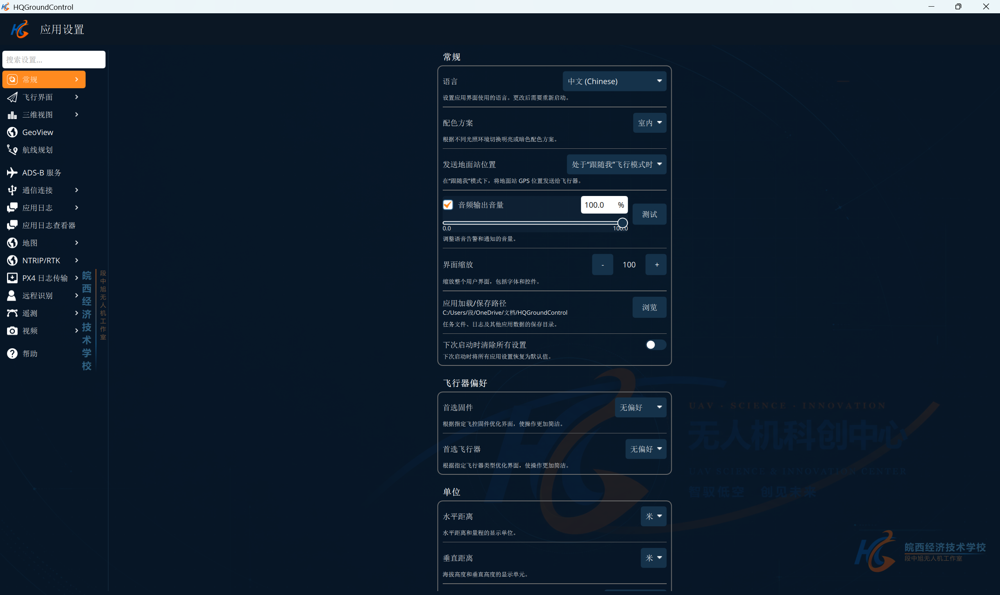

 🚁 HQGroundControl

基于 QGroundControl 二次开发的第三方无人机地面站

全面中文化 · 快速飞行数据 · HUD 姿态显示 · PX4 / ArduPilot**

[📦 下载最新版本](../../releases/latest) · [🐛 问题反馈](../../issues)

---

📖 项目介绍

HQGroundControl** 是基于开源无人机地面站 **QGroundControl (QGC)** 进行二次开发的第三方版本。

本项目在保留 QGroundControl 主要功能的基础上，针对无人机实际使用、调试及教学场景进行了中文化、功能扩展及使用体验优化，并加入了部分原版 QGroundControl 中未提供的自定义功能。

> 本项目并非 QGroundControl 官方发行版本。

---

⭐ 相比官方 QGroundControl 的主要改进

 🇨🇳 全面中文化

对 QGroundControl 的界面、菜单及相关功能进行了进一步中文化处理，降低中文用户的使用门槛，更适合无人机教学、学习和日常调试使用。

 📊 快速数据面板

在主界面增加 **快速数据面板**，无需频繁切换页面即可查看无人机关键飞行数据。

可快速查看包括：

* 相对高度
* GPS HDOP / VDOP
* 水平精度 / 垂直精度
* 横滚角 / 俯仰角 / 航向角
* 航点距离
* 卫星数量
* 升降速度
* 地面速度
* GPS 航向
* 飞行时间
* 经纬度等飞行数据

 🛩️ HUD 姿态显示

在主地图界面增加 HUD 姿态显示，可在查看地图的同时快速掌握无人机姿态、高度、速度等信息。

---

 ✨ 主要功能

* 🚁 支持 **PX4** 与 **ArduPilot**
* 🗺️ 无人机地图及飞行状态监控
* 🎛️ 飞控参数查看、配置与调试
* 🧭 传感器校准
* 📍 航点及任务规划
* 📊 主界面快速飞行数据
* 🛩️ HUD 姿态显示
* 🇨🇳 中文化界面
* ⚙️ 针对实际调试与教学场景进行功能优化

---

 📦 下载

 最新版本：HQGroundControl v1.0.0

Windows x64**

👉 **[前往 Releases 下载最新版](../../releases/latest)**

进入 Release 页面后，请在 **Assets** 中下载手动上传的 **HQGroundControl 软件压缩包**。

> ⚠️ GitHub 自动生成的 `Source code (zip)` 和 `Source code (tar.gz)` 并不是 HQGroundControl 的 Windows 软件包，请勿下载错误。

---

 💻 使用方法

1. 从 **Releases** 下载最新版 HQGroundControl 软件包。
2. 将 ZIP 压缩包完整解压至本地文件夹。
3. 运行 `HQGroundControl.exe`。
4. 连接飞控后即可进行相关配置、调试及飞行操作。

> 建议不要直接在 ZIP 压缩包内运行程序，请先完整解压。

---

#🔧 支持的飞控

| 飞控系统      | 支持情况 |
| --------- | ---- |
| PX4       | ✅ 支持 |
| ArduPilot | ✅ 支持 |

实际功能支持情况可能因飞控固件版本、硬件及通信方式不同而有所差异。

---

 📋 更新日志

 v1.0.0

HQGroundControl 首个公开发布版本。

主要内容：**

* 完成 HQGroundControl 首个公开版本
* 对 QGroundControl 界面进行中文化
* 增加主界面快速数据面板
* 增加 HUD 姿态显示
* 优化部分界面及使用体验
* 保留 QGroundControl 原有主要飞控功能

后续版本将继续增加和完善相关功能。

---

 ⚠️ 免责声明

HQGroundControl 是基于 QGroundControl 二次开发的**第三方项目**，并非 QGroundControl 官方发行版本，与 QGroundControl 官方开发团队不存在官方隶属关系。

无人机系统的实际运行受到飞控固件、硬件设备、通信链路、传感器、GNSS、参数配置及运行环境等多种因素影响。本软件无法保证在所有设备、配置和环境下均不存在错误或异常。

使用者应充分了解无人机及相关设备的操作方法，并在实际飞行前完成必要的设备检查、参数确认及安全测试，同时遵守所在地适用的法律法规及飞行安全要求。

因使用或无法使用本软件产生的责任，应根据适用法律、相关许可证及具体情况确定。

---

 📄 QGroundControl 与开源许可

本项目基于 **QGroundControl** 进行二次开发。

QGroundControl 原项目：

https://github.com/mavlink/qgroundcontrol

QGroundControl 采用 **Apache License 2.0**。

HQGroundControl 对 QGroundControl 进行了修改及功能扩展。QGroundControl 原项目的版权及相关权利归其原作者和贡献者所有。

本项目的发布及再分发应遵循 QGroundControl 原项目及所使用第三方组件的相关许可证要求。

---

 HQGroundControl

**让无人机地面站更适合中文用户使用**

基于 QGroundControl 二次开发

